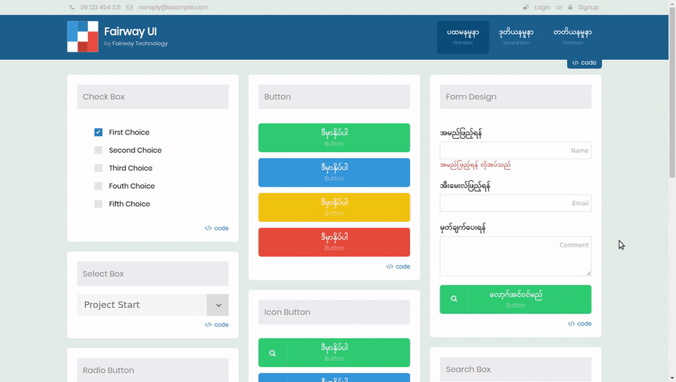

# Fairway UI
A collection of web UI components including responsive menu, mobile friendly form inputs, dual-language action buttons and etc...



## Components

Currently, the collection includes following components.

* Responsive top Menu (with optional icon)
* Responsive main Main (with optional icon)
* Mobile Friendly Form Inputs
    * Checkbox
    * Radio option
    * Toggle switch
    * Select input
    * Text Input with dual-language label
    * Dual-language Buttons (optional icon)
    * Search inputs (with button)
* Section titles

More components such as brand, cards, tabs and drop-down will be included in the collection soon.

## Usage
Connect style file from CDN.

```
<link href="https://fairway-tech.github.io/fairway-ui/css/fairway-ui.min.css" rel="stylesheet">
```

**Font Awesome** is required for icons. Although you can skip it if you don't need icons in your UI, we recommend to use Fairway UI together with Font Awesome. Visit <a href="http://fontawesome.io">fontawesome.io</a> for the instruction. Some components, especially select input, require JavaScript as well.

```
<script src="https://ajax.googleapis.com/ajax/libs/jquery/3.2.1/jquery.min.js"></script>
<script src="https://fairway-tech.github.io/fairway-ui/js/fairway-ui.min.js"></script>
```

Notice that **jQuery** is also a requirement. But, JavaScript are not necessary for other components. Other components including responsive menu are **CSS-only** components.

See our demo page for the usage example of each components.

* <a href="https://fairway-tech.github.io/fairway-ui/">Fairway UI Demo</a>

## License
Fairway UI is licensed under **MIT** license. You can freely <a href="https://github.com/fairway-tech/fairway-ui/archive/master.zip">download source code</a>, modify and re-distribute Fairway UI under the terms described in LICENSE.md.
